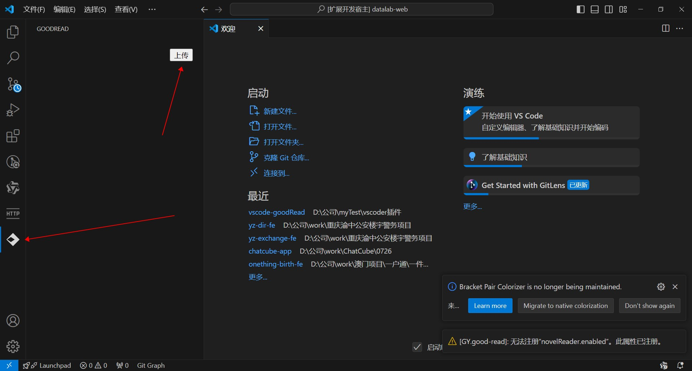
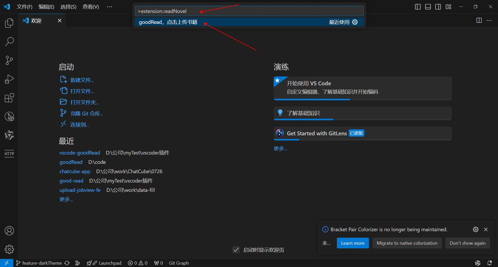
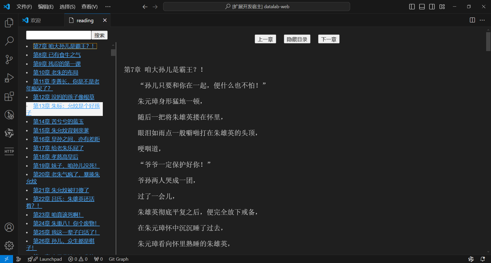

# good-read README

这是一个上班摸鱼的看小说的好插件,页面样式参考了网页版的小说布局，基本功能都有了，目前只支持txt文件
支持两种方式阅读，一种是侧边栏模式，一种是面板模式

1. 支持上传txt文件
2. 支持翻页
3. 支持搜索
4. 支持目录
5. 支持目录跳转
6. 支持目录隐藏
7. 支持快捷键翻页（左键翻页，右键翻页）
8. 支持快捷键隐藏显示内容：Ctrl + Shift + Z

## 面板模式
* `Ctrl + Shift + P`：快捷键打开命令面板
* `extension.readNovel`: 命令面板输入这个，上传小说txt文件.

## 侧边栏模式
* 点击左侧图标：打开左侧面板
* 点击上传按钮: 上传小说txt文件.

## 示例

## Known Issues

 None.

## Release Notes

 None.

### 1.0.0

Initial release of ...
 

**Enjoy!**
